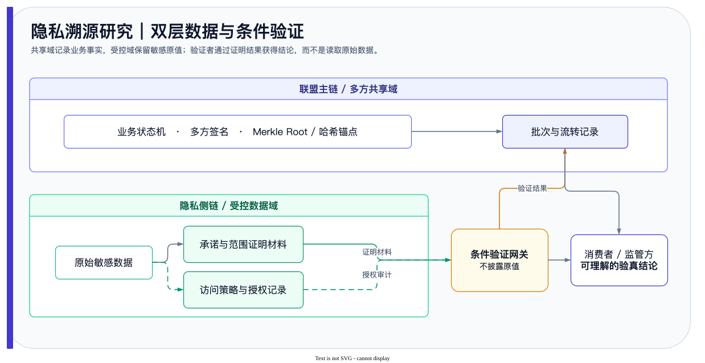

<!-- README-ARCHITECT: visual-shell -->
<p align="center">
  
</p>
<p align="center">
  <a href="https://github.com/ChrysFu-FndVent/privacy-traceability-research/stargazers"></a>
  <a href="https://github.com/ChrysFu-FndVent/privacy-traceability-research/commits/main"></a>
  <a href="https://github.com/ChrysFu-FndVent/privacy-traceability-research/search?l=Python"></a>
</p>
<!-- README-ARCHITECT: visual-shell end -->

<a id="readme-top"></a>
<div align="right"><a href="#简体中文">简体中文</a> | <a href="#english">English</a></div>

<div align="center">
<h1>Privacy Traceability Research</h1>
<p><em>Research workflow notes with a minimal hash-chain integrity demonstration.</em></p>


<p><a href="workflows.md">🧭 Research flow</a> · <a href="skills.md">🧩 Experiment modules</a> · <a href="prompt-engineering.md">💬 Prompt practice</a> · <a href="data-analysis.md">📊 Analysis</a></p>

</div>

<a id="简体中文"></a>

## 概览

本仓库收录隐私可追溯主题的研究工作流、实验模块设计、Prompt、产品化与数据分析材料。`src/integrity_demo.py` 是最小哈希链完整性演示，不是未公开研究原型，也不实现完整的双链架构或业务验真系统。

## 仓库内容

| 内容 | 已有文件 |
|---|---|
| 研究问题、方案比较与评估流程 | [workflows.md](workflows.md) |
| 实验模块设计 | [skills.md](skills.md) |
| AI 辅助科研 Prompt 实践 | [prompt-engineering.md](prompt-engineering.md) |
| 状态机、验真流程与研究分析材料 | [product-design.md](product-design.md) · [data-analysis.md](data-analysis.md) |
| 哈希链完整性演示 | [src/integrity_demo.py](src/integrity_demo.py) |

## 运行完整性演示

```bash
python3 src/integrity_demo.py --self-test
python3 src/integrity_demo.py
```

示例按稳定 JSON 编码计算链式 SHA-256 哈希，并在记录载荷被修改后报告首个失效位置。

## 使用边界

- 该示例用于理解完整性校验，不提供生产级密钥管理、签名、零知识证明或智能合约实现。
- 研究结论、性能与业务可行性应以仓库中对应的研究材料和独立实验为准。
- 不将演示记录视为真实业务记录或隐私保护保证。

<a id="english"></a>

## Overview

This repository collects research workflow, experiment-module design, prompt, productization, and analysis material for privacy traceability. `src/integrity_demo.py` is a minimal hash-chain integrity demonstration, not an unpublished research prototype or a full dual-chain architecture and verification system.

## Contents

| Content | Existing file |
|---|---|
| Research questions, solution comparison, and evaluation flow | [workflows.md](workflows.md) |
| Experiment-module design | [skills.md](skills.md) |
| AI-assisted research prompt practice | [prompt-engineering.md](prompt-engineering.md) |
| State-machine, verification-flow, and analysis material | [product-design.md](product-design.md) · [data-analysis.md](data-analysis.md) |
| Hash-chain integrity demonstration | [src/integrity_demo.py](src/integrity_demo.py) |

## Run the Integrity Demonstration

```bash
python3 src/integrity_demo.py --self-test
python3 src/integrity_demo.py
```

The demonstration computes chained SHA-256 hashes over canonical JSON and reports the first invalid position after a record payload changes.

## Scope

- It explains integrity checks; it does not provide production key management, signatures, zero-knowledge proofs, or smart-contract implementation.
- Consult the repository's research material and independent experiments for conclusions, performance, and business feasibility.
- Do not treat demonstration records as real business records or a privacy guarantee.
