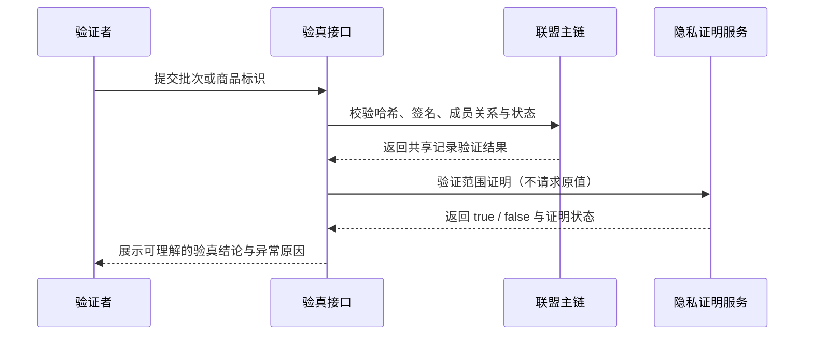

# 隐私溯源研究工具包

<div align="center">

<strong>🔐 验证事实，不暴露不该公开的原始值</strong>

<br>

`trust model` · `dual-chain architecture` · `privacy proof` · `evidence boundary`


📚 [研究流程](./workflows.md) · 🧪 [实验模块](./skills.md) · 🧠 [科研 Prompt](./prompt-engineering.md) · 🧭 [产品化设计](./product-design.md) · 📏 [数据与限制](./data-analysis.md)

</div>

> [!WARNING]
> 本仓库发布的是**研究方法、实验模块规格和结果记录**，不是经过安全审计的区块链或零知识证明实现。`src/integrity_demo.py` 是独立编写的哈希链完整性参考演示，不是论文实验源码，不能用于生产或复现论文性能数据。

## 研究简介

多方溯源需要同时回答两类问题：记录怎样跨主体互信，敏感原始值怎样在不公开的前提下被验证。本工具包从参与方、信任缺口和披露规则出发，设计联盟主链与隐私侧链，再用哈希、签名、Merkle、承诺/范围证明和状态机的单机原型验证关键技术原语。

| 研究输入 | 研究输出 |
|---|---|
| 参与方、业务状态、信任假设、敏感字段、允许披露内容、实验环境 | 双链架构、权限与状态机、实验模块、性能记录、反向测试和生产差距 |

## 核心问题

- 谁可以写入、背书、查询和纠错？
- 哪些记录需要多方共享，哪些原始值不能公开？
- 验证者需要知道原值，还是只需知道“值在允许区间内”？
- 业务状态如何防止非法跳转、越权调用和历史改写？
- 单机实验能够支撑哪些主张，不能外推哪些生产结论？

## 架构亮点

### 公开验证与隐私数据分层

<p align="center">
  
</p>

<p align="center"><sub>可编辑版本：<a href="./assets/readme-architecture.drawio">readme-architecture.drawio</a></sub></p>

### 验真路径



## 效果展示

### 研究任务配置

```yaml
scenario: 多方参与的定制商品生产与流转
participants: [原料方, 生产方, 质检方, 物流方, 销售方, 用户, 监管方]
trust_gaps: [记录可能被改写, 多方记录难互认]
sensitive_data: [用户原始测量数据]
allowed_disclosure: [是否在允许区间, 批次状态, 多方背书结果]
state_transitions: 原料 -> 生产 -> 质检 -> 流转 -> 销售或召回
prototype_scope: [哈希链, 签名, Merkle, 承诺与范围证明, 状态机]
excluded_claims: [生产吞吐, 端到端延迟, 安全审计结论, ROI]
```

### 可公开实验记录

| 数据 | 证据支持的含义 | 不能推导的结论 |
|---|---|---|
| **0.173 ms** | Python 单机模拟中的联盟链单笔交易验证耗时 | 分布式生产网络端到端延迟 |
| **0.583 ms** | Python 单机模拟中加入零知识证明后的验证耗时 | 完整扫码体验或生产吞吐 |
| **约 620 万元 / 2–3 年** | 引用资料中的传统跨机构对账成本与周期基线 | 区块链方案节省额或投资回收期 |

## 功能与研究模块

| 模块 | 验证目标 | 反向测试 |
|---|---|---|
| 哈希链完整性 | 历史记录修改是否可被发现 | 篡改任意记录 |
| ECDSA 多方签名 | 背书主体与内容是否一致 | 错误签名、替换消息 |
| Merkle 轻验证 | 单条记录是否属于某批次 | 伪造路径或叶子 |
| 状态机模拟 | 状态转换与角色权限是否有效 | 非法跳转、越权调用 |
| 承诺与范围证明 | 不公开原值时验证区间条件 | 错误证明、越界值 |
| 端到端基准 | 记录组合原语后的单机耗时 | 不同规模与重复运行 |

模块规格见 [skills.md](./skills.md)，状态机和消费者体验见 [product-design.md](./product-design.md)。

## 研究技术栈

| 领域 | 研究对象 |
|---|---|
| 数据完整性 | Hash chain、Merkle tree |
| 身份与背书 | ECDSA 数字签名、多方验证 |
| 隐私证明 | Commitment、范围证明、零知识思想 |
| 业务约束 | 智能合约状态机、RBAC 权限 |
| 原型环境 | Python 单机实验（源码未在本仓库发布） |
| 公开参考实现 | Python 3 标准库；规范化 JSON、哈希链构造与篡改检测 |
| 研究协作 | 文献矩阵、AI 三级信任、反向测试、边界审计 |
| 文档表达 | Markdown、YAML、draw.io、SVG、Mermaid |

## 安装与部署

### 安装与运行

```bash
git clone https://github.com/ChrysFu-FndVent/privacy-traceability-research.git
cd privacy-traceability-research
```

文档无需安装依赖。运行独立参考演示需要 Python 3.9 或更高版本，不依赖第三方包：

```bash
python3 src/integrity_demo.py
python3 src/integrity_demo.py --self-test
```

该演示只说明“记录被修改后哈希链验证会失败”，不实现签名、Merkle、零知识证明、共识或网络。研究文档推荐按问题而非文件名顺序阅读：

1. 从 [workflows.md](./workflows.md) 形式化信任、完整性、隐私和效率问题。
2. 用 [product-design.md](./product-design.md) 查看 8 状态生命周期、7 类权限和 5 个接口。
3. 按 [skills.md](./skills.md) 将架构主张映射到六类实验模块。
4. 用 [data-analysis.md](./data-analysis.md) 检查实验环境、数字口径和生产差距。
5. 参考 [prompt-engineering.md](./prompt-engineering.md) 管理 AI 辅助科研的证据等级。

如需复现实验，应根据模块规格在独立环境重建代码、固定依赖版本并补充安全评审；不要把文档中的模块名当成已发布脚本路径。

### 部署边界

当前仓库不需要也不支持部署为区块链节点、验证服务或消费者验真接口。`integrity_demo.py` 适合在本地、教学或 CI 环境执行，用于验证哈希链篡改检测这一项基础行为。

生产部署需要独立实现成员与密钥管理、签名、Merkle、隐私证明、共识、存储、接口、监控和治理，并在上线前完成密码学复核、威胁建模与安全审计。

## 项目结构

```text
privacy-traceability-research/
├── README.md              # 研究入口、证据边界与 FAQ
├── .gitignore             # Python 缓存忽略规则
├── assets/
│   ├── readme-architecture.drawio  # 可编辑双层架构源文件
│   └── readme-architecture.svg     # README 矢量展示图
├── src/
│   └── integrity_demo.py   # Python 哈希链完整性参考演示
├── workflows.md           # 从业务痛点到可验证结论的研究流程
├── skills.md              # 六个 Python 实验模块的规格拆解
├── prompt-engineering.md  # AI 辅助科研的 Prompt 与信任分级
├── product-design.md      # 状态机、RBAC 与消费者验真体验
└── data-analysis.md       # 单机基准、问题基线与生产差距
```

## FAQ

<details>
<summary><strong>公开的 Python 文件是原论文实验源码吗？</strong></summary>

不是。公开文件是根据研究架构独立编写的最小完整性演示，只覆盖哈希链构造和篡改检测。原论文的六个实验模块、依赖、数据与性能测试源码仍未发布，不能用该演示复现 README 中的性能数字。
</details>

<details>
<summary><strong>0.173 ms 和 0.583 ms 能代表线上性能吗？</strong></summary>

不能。它们只属于指定 Python 单机模拟路径，未包含网络、共识、存储、节点治理、接口和终端渲染时间。
</details>

<details>
<summary><strong>原始敏感数据会上链吗？</strong></summary>

设计目标是不让原始敏感值进入公开共享域，只保存必要的承诺、证明或哈希材料。具体系统仍需做数据最小化、访问控制、密钥管理和隐私影响评估。
</details>

<details>
<summary><strong>可以将这里的密码学方案直接投入生产吗？</strong></summary>

不可以。生产实现需要密码学专家复核、安全审计、密钥生命周期设计、依赖审查、攻击测试和治理方案。
</details>

<details>
<summary><strong>可以把参考演示部署成消费者验真服务吗？</strong></summary>

不可以。参考演示没有身份认证、持久化、网络接口、多方签名或隐私证明能力，只能在单进程内构造并检查示例哈希链。验真服务必须另行实现并接受安全评审。
</details>

## 证据与安全边界

- 性能数字必须同时记录环境、数据规模和运行方式。
- 篡改、错误签名、非法状态跳转和越权调用必须有反向测试。
- 论文主张、原型证据和生产假设必须分别标注。
- 原始敏感值不上共享链，公开材料不得反推出原值。
- 成本基线不能直接转写为方案收益或 ROI。

---

<div align="center">

[浏览其他独立 AI 产品项目](https://github.com/ChrysFu-FndVent?tab=repositories)

</div>
