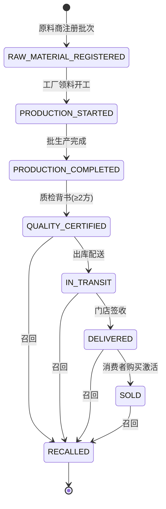

# 产品设计 · 智能合约状态机与消费者验真流程的产品化

> 资产类型：技术方案的产品化设计
> 用途：学术方案要"能用"，必须完成两次产品化翻译——把多方协作规则翻译成**智能合约状态机**，把密码学验证翻译成**消费者可用的验真流程**。这两个设计是论文中最"产品经理"的部分。

## 一、智能合约状态机：把业务规则写成不可绕过的流程

### 8 状态生命周期

### 设计决策（产品视角）

| 决策 | 理由 |
|---|---|
| 质检背书（≥2 方）是售出的必经状态 | 把"质量合格"从管理承诺变成协议约束——没有 2 方签名，合约层面无法进入可售状态 |
| RECALLED 可从 4 个状态进入 | 召回是安全兜底，任何售前售后环节发现问题都能立即冻结流通 |
| SOLD 由消费者扫码激活 | 购买行为写入状态机，使"一瓶一码"具有防复用能力（已 SOLD 的码再次验真会显示异常） |
| RBAC 7 角色权限矩阵 | 原料商/工厂/质检/物流/门店/消费者/监管各自只能触发自己职责内的状态转移 |

### 5 个核心接口 = 5 个用户故事

| 接口 | 用户故事 |
|---|---|
| registerProduct | 作为工厂，我登记一个新批次，获得链上唯一身份 |
| addTraceNode | 作为流转参与方，我为批次追加我环节的记录 |
| endorseProduct | 作为质检方，我对批次独立背书签名 |
| verifyAuthenticity | 作为消费者，我验证手中产品的真实性 |
| freezeProduct | 作为监管/工厂，我冻结问题批次的流通 |

## 二、消费者验真流程：把密码学翻译成低门槛体验

### 四重校验（技术流程）

扫码 → ① 哈希校验（记录未被篡改）→ ② 签名校验（多方背书真实）→ ③ Merkle 成员证明（记录确在该批次）→ ④ 状态校验（当前状态为 DELIVERED/SOLD 且未召回）。论文仅对单机验证路径做性能基准，完整体验仍需接口与网络环境验证（见 [data-analysis.md](./data-analysis.md)）。

### 体验设计原则：隐藏机制，呈现结论

消费者不需要知道 Merkle 树是什么。验真结果页设计为三层递进披露：

1. **第一眼（默认）**：一个大号结论——"✓ 正品 · 批次可信"或"⚠ 异常 · 请勿使用并联系客服"，配颜色语义；
2. **第二层（下滑）**：人话版溯源故事——"你的这瓶产品：X月X日由 XX 工厂调配 → 质检双签通过 → X日送达门店"；
3. **第三层（技术详情，可展开）**：四重校验逐项结果、区块高度、背书方公钥指纹——给成分党/技术用户和监管人员。

**异常态设计**：四重校验任一失败都映射为一句用户能行动的话（如状态校验发现已 SOLD → "该码已被使用过，谨防复用假冒"），而不是"验证失败 error 0x03"。

## 三、多方协作的“冷启动”产品思考

联盟链的经典死结：所有参与方都上链才有价值，但谁先上链谁先付成本。论文给出的渐进路线是产品化思维的体现：

| 阶段 | 参与方 | 提供价值 |
|---|---|---|
| 1. 单厂内部链 | 工厂自己 | GMP 审计包自动化（内部降本，不依赖他人） |
| 2. 厂 + 门店 | 加入门店节点 | 一瓶一码验真上线（营销价值：正品保障叙事） |
| 3. 全链路联盟 | 原料商、质检、监管加入 | 完整多方背书与监管接口（信任价值全量释放） |

每个阶段都设置独立验收点，不需要等完整生态建成后再验证；这种分阶段验证方式与[受控配方系统的试点决策框架](https://github.com/ChrysFu-FndVent/constrained-formulation-agent/blob/main/data-analysis.md)相呼应。

## 四、可迁移方法论

1. **规则产品化 = 让违规在机制上不可能**：状态机把"应该先质检再销售"从制度约束变成协议约束——好的产品设计让正确的事成为唯一路径；
2. **技术能力的体验翻译**：机制隐藏、结论前置、详情可展开——三层递进披露适用于一切"技术复杂但用户只要结论"的场景（AI 置信度、风控结果同理）；
3. **多方系统分阶段验证单方价值**：依赖网络效应的方案，也要先说明首个参与方能独立获得什么可验证价值。
