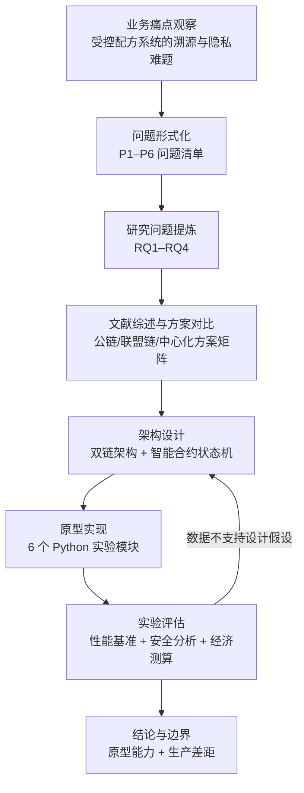

# Workflows · 科研工作流：从业务痛点到可验证结论

> 资产类型：研究方法工作流
> 用途：沉淀一条"业务问题 → 形式化 → 方案设计 → 原型实验 → 多维评估"的完整科研工作流。它与产品工作流同构：都是把模糊诉求转化为可验证交付的过程。

## 一、研究工作流总览

## 二、逐阶段拆解

### 阶段 1 · 问题形式化：把"感觉不安全"变成 P1–P6

业务侧的原始表述是"消费者不信任定制产品、皮肤数据敏感"。研究的第一步是把它拆成 6 个**可独立验证**的问题（P1 记录可篡改 / P2 单方不可信 / P3 上链成本 / P4 流程无约束 / P5 隐私泄露 / P6 验真门槛），每个问题绑定：威胁模型（谁、如何攻击）→ 现有方案为何不足 → 成功标准。

**方法论**：问题不可验证 = 问题没拆完。P1–P6 每一条都能写出"实验通过/不通过"的判据，这是后续所有工作的锚点。

### 阶段 2 · 研究问题提炼：RQ 是问题簇的公因式

- RQ1：如何以可承受成本保证全链路记录完整性？（P1+P3）
- RQ2：多参与方（原料商/工厂/门店/监管）如何互信？（P2+P4）
- RQ3：消费者端验证能否做到低门槛、高效率？（P3+P6）
- RQ4：隐私保护与数据可用性如何平衡？（P5）

### 阶段 3 · 方案对比：决策矩阵而非技术偏好

| 方案 | 完整性 | 多方信任 | 成本 | 隐私 | 结论 |
|---|---|---|---|---|---|
| 中心化数据库 + 审计 | 弱 | 弱 | 低 | 可控 | 不满足 P1/P2 |
| 公链全量上链 | 强 | 强 | 极高 | 差 | 不满足 P3/P5 |
| **联盟链 + 侧链（选定）** | 强 | 强（背书机制） | 可控（Merkle 缩减） | 强（承诺+ZKP） | 全覆盖 |

### 阶段 4 · 原型实验：设计主张逐条对应实验模块

架构中每个关键主张都有专属实验模块验证（模块详情见 [skills.md](./skills.md)）：哈希链防篡改→01 模块；多方背书→02 模块；轻验证效率→03 模块；状态机约束→04 模块；隐私范围证明→05 模块；端到端性能→06 模块。

### 阶段 5 · 多维评估：技术之外还要回答"值不值"

- **性能维度**：密码学原语基准 + 端到端验真时延；
- **安全维度**：按威胁模型逐项分析（篡改/合谋/重放/隐私推断）；
- **问题基线**：传统跨机构对账约 620 万元、周期 2–3 年；不直接改写为方案节省或回收期；
- **成熟度维度**：明确“原型验证”与“生产可用”的差距清单。

## 三、AI 工具在科研流程中的使用方式

| 环节 | AI 用法 | 人工把关 |
|---|---|---|
| 文献综述 | AI 辅助论文速读、方案对比表初稿 | 关键论文精读、引用逐条核对 |
| 代码实现 | AI 生成实验模块骨架与测试用例 | 密码学逻辑逐行审查（AI 常犯协议细节错误） |
| 数据分析 | AI 生成可视化脚本 | 统计口径与单位换算人工复核 |
| 论文写作 | AI 润色表达、检查逻辑断层 | 所有主张回查实验数据 |

具体 Prompt 实践见 [prompt-engineering.md](./prompt-engineering.md)。

## 四、可迁移方法论：科研工作流 ≈ 产品工作流

| 科研 | 产品 |
|---|---|
| 业务痛点 → P1–P6 形式化 | 用户反馈 → 问题定义 |
| RQ 提炼 | 北极星指标与假设 |
| 方案决策矩阵 | 竞品/技术选型分析 |
| 原型实验逐条验证主张 | MVP 验证核心假设 |
| 原型边界与生产差距 | 上线评审与风险清单 |

**核心纪律**：任何主张（论文里的贡献点 / PRD 里的收益预期）都必须预先定义验证方法，使结论强度与证据保持一致。
